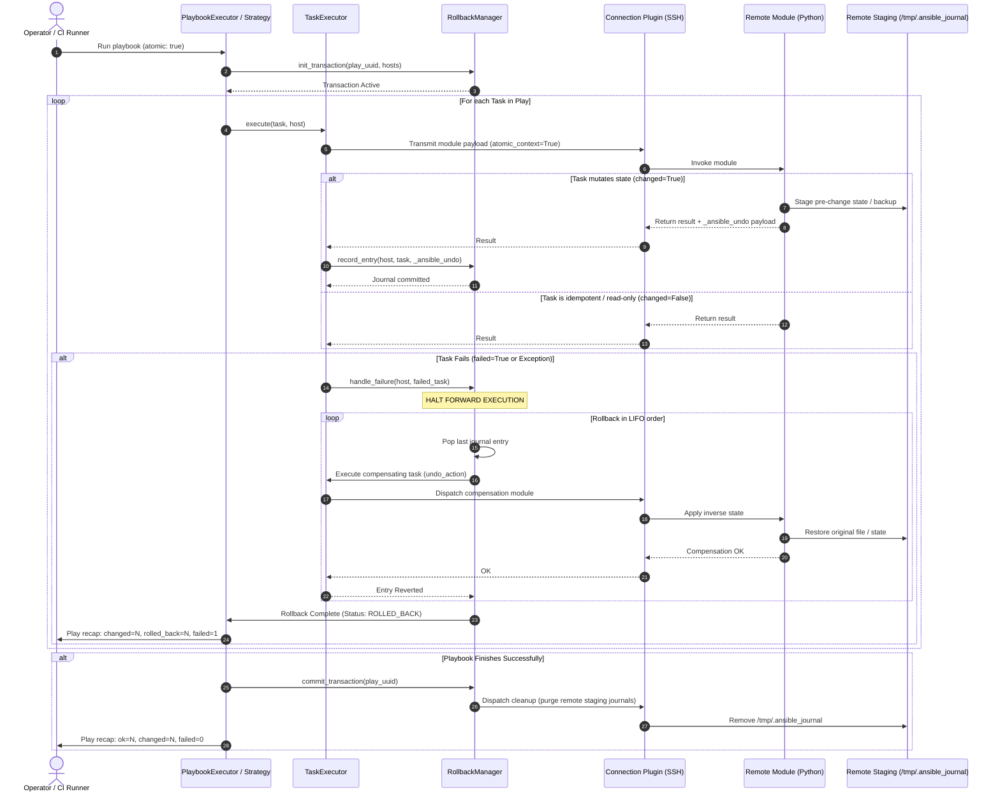

# Ansible Transaction Mode: Architecture & State Specification

This document details the internal architectural mechanics, state machines, and sequence flows governing Atomic Playbook Execution in `ansible-core`.

---

## 1. End-to-End Sequence Diagram

---

## 2. Failure Handling Taxonomy

In transaction mode, failures can occur at various stages. The engine defines explicit behavior for each:

| Failure Type | Engine Action | User Impact |
| :--- | :--- | :--- |
| **Normal Task Failure** (e.g. invalid templating, test assertion failed, package not found) | Immediately halts forward execution. Triggers reverse compensation for all previously mutated tasks for that host. | Host is restored to pre-play state. Exit code 2. |
| **Non-Atomic Module Encountered** (under `rollback_policy: strict`) | Pre-flight lint or runtime check halts play before mutation occurs. | No changes made. Play aborted safely. |
| **Non-Atomic Module Encountered** (under `rollback_policy: best_effort`) | Engine issues `ANSIBLE_WARNING_UNSUPPORTED_ATOMIC`. If rollback occurs, this task cannot be reversed and is flagged in the recap as `unreverted`. | Partial rollback; operator alerted to manual remediation. |
| **Rollback Compensation Failure** (failure during the undo phase itself) | Emits `CRITICAL: ROLLBACK_FAULT`. Halts rollback of earlier entries to prevent cascading corruption. Persists journal to disk for post-mortem recovery. | Operator receives exact JSON journal path and step failure report. |
| **Network Disconnect during Forward Execution** | Unreachable host triggers rollback on remaining connected hosts (if `serial` or strategy mandates), or marks host `UNREACHABLE`. | Remote staged journal remains on remote host until TTL expiry or manual recovery. |

---

## 3. Remote Journal Isolation & Lifecycle

To ensure security and zero interference with production systems:
1. **Directory**: `/tmp/.ansible_journal_<uuid>/` (or user-configurable via `ansible.cfg: [defaults] journal_path`).
2. **Permissions**: POSIX `0700`, owned by SSH connection user or `become_user`.
3. **Storage Strategy**:
   - Files are backed up with metadata preserved (`shutil.copystat`).
   - If files are on the same filesystem, hard links (`os.link`) are used for near-zero I/O overhead and instant snapshots.
4. **Cleanup Guarantee**:
   - Successful play commit executes an automatic garbage-collection task that unlinks the staging directory.
   - Remote journal entries have a default TTL of 24 hours to prevent inode leakage in catastrophic power-off scenarios.
