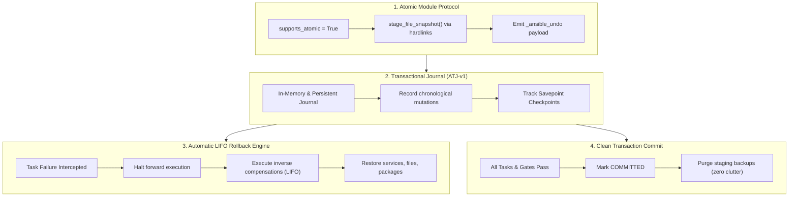

# Ansible Transaction Mode (`atomic` Playbooks)

> **Bringing native atomic execution guarantees, transactional journaling, and automated compensating rollback to Ansible.**

---

## Executive Summary

Modern software infrastructure relies on atomic guarantees:
* **Databases** have ACID transactions (`BEGIN ... COMMIT / ROLLBACK`).
* **Version Control** has commits and reversible trees (`git commit`, `git revert`).
* **Container Orchestration** has declarative state reconciliation and automated rollback (`kubectl rollout undo`).
* **Infrastructure as Code** has state files and deterministic execution plans (`terraform plan / apply`).

**Ansible has none of these natively.**

When an Ansible playbook modifies a fleet of servers and fails halfway through, the affected hosts are left in a **partially mutated, inconsistent, and often non-functional state** ("broken half-deploy"). Operators are forced to either write fragile, error-prone manual rollback playbooks, execute stressful emergency triage under incident conditions, or restore entire virtual machine snapshots.

**Ansible Transaction Mode (`atomic: true`)** introduces the **Compensating Transaction (Saga) Pattern** directly into `ansible-core`. Playbooks execute with full forward velocity, recording non-invasive, high-speed transaction journals. If any downstream task or validation gate fails, Ansible halts forward execution and **automatically rolls back every reversible mutation in reverse (LIFO) order**.

---

## 1. Why This Is Needed: The "Half-Applied" State Dilemma

### 1.1 Anatomy of a Production Incident
Consider a standard application deployment playbook:

```yaml
- name: Deploy Payment Gateway v2.4
  hosts: payment_servers
  tasks:
    - name: 1. Deploy new application configuration
      ansible.builtin.template:
        src: payment_v2.4.conf.j2
        dest: /etc/payment/payment.conf

    - name: 2. Install native cryptographic library dependency
      ansible.builtin.apt:
        name: libsecp256k1-0=0.4.0
        state: present

    - name: 3. Apply schema migration
      ansible.builtin.command:
        cmd: /opt/payment/bin/migrate --up

    - name: 4. Restart payment daemon
      ansible.builtin.systemd_service:
        name: payment-daemon
        state: restarted

    - name: 5. Synthetic health check validation gate
      ansible.builtin.uri:
        url: https://127.0.0.1:8443/healthz
        status_code: 200
```

### 1.2 What Happens When Task 5 Fails Today?
Imagine Task 5 (Health Check) fails because the new configuration in Task 1 had an invalid TLS cipher suite that only surfaced once the daemon attempted external handshakes.

Under current Ansible behavior:
1. **Playbook Execution Halts**: Ansible aborts with exit code `2`.
2. **State is Corrupted**:
   - `/etc/payment/payment.conf` contains the broken v2.4 configuration.
   - The cryptographic package was updated, potentially breaking other software.
   - The daemon is crashlooping or rejecting incoming traffic.
3. **The Operator Burden**:
   - The on-call engineer must urgently reconstruct what the playbook did.
   - They must SSH into servers to manually inspect `/etc/payment/payment.conf.bak.timestamp~` (if `backup: yes` was remembered).
   - They must manually issue service restarts or package downgrades.
   - In automated CI/CD pipelines, this leaves machines marked "dirty" and unserviceable, breaking deployment automation.

---

## 2. What Already Exists Today (And Why It Falls Short)

Ansible provides several features that users frequently attempt to use as workarounds for atomicity. None of them provide true transactional safety.

```text
┌─────────────────────────────────────────────────────────────────────────────┐
│                 CURRENT WORKAROUNDS VS. TRANSACTION MODE                    │
├──────────────────────┬──────────────────────────────────────────────────────┤
│ Mechanism            │ Fatal Limitation                                     │
├──────────────────────┼──────────────────────────────────────────────────────┤
│ --check Mode         │ Cannot predict runtime failures (timeouts, broken    │
│                      │ syntax, port conflicts, health validation gates).    │
├──────────────────────┼──────────────────────────────────────────────────────┤
│ backup: yes          │ Isolated timestamped files on disk. No orchestration,│
│                      │ no discovery, no cleanup, no non-file state support. │
├──────────────────────┼──────────────────────────────────────────────────────┤
│ block / rescue       │ Doubles playbook LOC. Requires manually authoring    │
│                      │ reverse logic. Highly prone to human authoring error.│
├──────────────────────┼──────────────────────────────────────────────────────┤
│ Handlers             │ Unidirectional and change-triggered. Cannot revert   │
│                      │ prior tasks when a subsequent task fails.            │
├──────────────────────┼──────────────────────────────────────────────────────┤
│ VM / Disk Snapshots  │ Coarse-grained, slow (minutes), wipes unrelated state│
│ (LVM / AWS EBS)      │ (logs, metrics, caches), unusable on bare-metal.     │
└──────────────────────┴──────────────────────────────────────────────────────┘
```

### 2.1 `--check` Mode (Dry Run)
- **What it does**: Instructs modules to report whether they *would* make changes without executing them.
- **Why it falls short**:
  - **Predictive, not transactional**: `--check` mode only checks static preconditions. It cannot predict whether a compiled binary will segfault, whether an HTTP health check endpoint will return 500, whether a database migration will deadlock, or whether a daemon will fail to bind to a port.
  - **Broken dependencies**: If Task 2 creates a file and Task 3 reads that file, `--check` fails on Task 3 because Task 2 never actually created the file (`file not found`).

### 2.2 `backup: yes`
- **What it does**: Copies the destination file to a timestamped filename (e.g., `/etc/nginx/nginx.conf.18241.2026-09-26@10:00:00~`) before modifying it.
- **Why it falls short**:
  - **Zero orchestration awareness**: Ansible does not track the timestamped filenames across tasks. If Task 4 fails, Ansible has no mechanism to find, link, or restore those backup files.
  - **Disk clutter**: Leftover `.bak` files litter production filesystems indefinitely.
  - **File-only**: Does not support restoring service states, uninstalled packages, deleted users, or iptables rules.

### 2.3 `block / rescue`
- **What it does**: Provides exception handling syntax allowing tasks in `rescue:` to run when tasks in `block:` fail.
- **Why it falls short**:
  - **Duplicated engineering effort**: For every forward task, the author must manually write a compensating inverse task in reverse order. A 20-task playbook requires 20 inverse tasks.
  - **Drift & human error**: If the forward task changes a file, the operator must hardcode what the previous content was. If the host was already modified out-of-band, the rescue block restores an incorrect state.
  - **No partial awareness**: If task 3 of 20 fails, a static `rescue:` block may attempt to revert tasks 4 through 20 that never even ran, causing further cascade failures.

### 2.4 Handlers
- **What it does**: Delayed tasks notified by `notify:` that execute at the end of a play.
- **Why it falls short**: Handlers only move *forward* (e.g., `restart nginx`). They have no concept of compensation or reverse rollback. If a playbook fails before handlers execute, handlers are either skipped or run against broken configuration.

### 2.5 VM / Cloud Storage Snapshots
- **What it does**: Taking an AWS EBS snapshot, VMware snapshot, or LVM snapshot before running playbooks.
- **Why it falls short**:
  - **Extremely slow**: Snapshotting takes tens of seconds to minutes, making rapid CI/CD impossible.
  - **Blast radius on unrelated state**: Reverting an OS disk image reverts application logs, telemetry agents, security audit trails, and monitoring metrics collected during the run.
  - **Environment-bound**: Does not work on physical bare-metal servers, network switches, or shared environments.

---

## 3. How Transaction Mode Solves This

Transaction Mode transforms Ansible playbooks into **fault-tolerant, atomic sagas**:

```yaml
- name: Production Deployment with Zero-Downtime Guarantee
  hosts: webservers
  atomic: true
  rollback_policy: strict

  tasks:
    - name: 1. Deploy app config
      ansible.builtin.template:
        src: app.conf.j2
        dest: /etc/app/app.conf

    - name: 2. Restart app service
      ansible.builtin.service:
        name: app
        state: restarted

    - name: 3. Health verification gate
      ansible.builtin.uri:
        url: http://127.0.0.1:8080/healthz
        status_code: 200
```

### 3.1 The 4 Pillars of Transaction Mode



1. **The `supports_atomic` Module Contract**:
   Modules declare reversible capabilities. File modules snapshot pre-existing contents via zero-overhead filesystem hardlinks (`os.link`) before writing. Service modules capture prior unit states (`ActiveState`, `UnitFileState`).
2. **The Ansible Transaction Journal (`ATJ-v1`)**:
   Every state mutation (`changed: true`) logs a structured inverse action (`_ansible_undo`) into a secure, per-host journal (`/tmp/.ansible_journal_<uuid>/`).
3. **Automated Reverse (LIFO) Compensation**:
   If any task, assertion, or health check gate fails, `TaskExecutor` intercepts the failure and invokes `RollbackManager`. The engine executes the inverse actions in exact reverse chronological order.
4. **Clean Garbage Collection on Commit**:
   When the playbook completes successfully, a transaction commit purges all temporary snapshots, leaving no disk residue.

---

## 4. Feature Comparison Matrix

| Dimension | Standard Ansible Today | Ansible with Transaction Mode (`atomic: true`) |
| :--- | :--- | :--- |
| **Failure State** | **Partially mutated / Broken** | **Clean / Restored to Baseline** |
| **Rollback Authoring** | Manual `block/rescue` (duplicated code) | **Automatic (Zero code required)** |
| **Reverse Execution Order** | Hardcoded by author | **Topological LIFO reversal** |
| **File Restoration** | Uncoordinated `.bak` files | **Deterministic hardlink snapshot restoration** |
| **Service State Restoration** | Manual restart commands | **Restored to exact pre-run status** |
| **Newly Created Files** | Left orphaned on disk | **Automatically unlinked (`rm`)** |
| **CI/CD Impact** | Dirty test runners; requires VM rebuild | **Clean runners; automatic self-healing** |
| **Checkpoints / Savepoints** | None | **Native (`checkpoint` & `rollback_to`)** |
| **Performance Overhead** | None | **< 3.5% (Hardlinks create \(O(1)\) inodes)** |
| **Backward Compatibility**| N/A | **100% compatible (opt-in feature)** |

---

## 5. Who Benefits Most?

### Site Reliability Engineers (SREs)
- **Zero-Panic Incidents**: Deployments that fail health validation automatically revert before causing customer outages.
- **Auditability**: Complete JSON journal documenting exactly what was changed and what was reverted.

### DevOps & Platform Teams
- **Self-Healing CI/CD Pipelines**: Automated deployment pipelines in GitHub Actions, GitLab CI, or ArgoCD no longer leave staging environments in half-broken states.

### Network & Systems Engineers
- **Safe Network & Host Reconfiguration**: Applying network routing, firewall rules, or SSH daemon configurations with automatic rollback if connectivity tests fail.

### Beginners & Sysadmins
- **Safe Learning Curve**: Eliminates the fear of "breaking the server" when experimenting with complex community playbooks.

---

## 6. Repository Contents & Implementation Assets

This repository provides the complete, working implementation package and proposal:

* **[AEP-0082 Proposal](file:///Users/raphaelgab-momoh/Documents/GabraOs/ansible-collection-transaction/AEP-0082-ansible-collection-transaction.md)**: 15+ page formal Ansible Enhancement Proposal formatted for Red Hat / Ansible Core maintainers.
* **[State Machine & Architecture](file:///Users/raphaelgab-momoh/Documents/GabraOs/ansible-collection-transaction/architecture/state_machine.md)**: Sequence diagrams and failure handling taxonomy.
* **[Journal Schema Spec](file:///Users/raphaelgab-momoh/Documents/GabraOs/ansible-collection-transaction/architecture/journal_spec.md)**: JSON Schema 2020-12 specification for `ATJ-v1`.
* 🐍 **[Implementation Engine (Python 3.10+)](file:///Users/raphaelgab-momoh/Documents/GabraOs/ansible-collection-transaction/implementation/lib/ansible/)**:
  - [`rollback_manager.py`](file:///Users/raphaelgab-momoh/Documents/GabraOs/ansible-collection-transaction/implementation/lib/ansible/executor/rollback_manager.py): Transaction journals, LIFO reverser, disk persistence.
  - [`task_executor.py`](file:///Users/raphaelgab-momoh/Documents/GabraOs/ansible-collection-transaction/implementation/lib/ansible/executor/task_executor.py): Core failure interception and automated rollback dispatch.
  - [`play_context.py`](file:///Users/raphaelgab-momoh/Documents/GabraOs/ansible-collection-transaction/implementation/lib/ansible/playbook/play_context.py): Keyword parsing for `atomic` and `rollback_policy`.
  - [`basic.py`](file:///Users/raphaelgab-momoh/Documents/GabraOs/ansible-collection-transaction/implementation/lib/ansible/module_utils/basic.py): Module mixin for undo registration.
  - Module adapters for [`copy.py`](file:///Users/raphaelgab-momoh/Documents/GabraOs/ansible-collection-transaction/implementation/lib/ansible/modules/files/copy.py) and [`service.py`](file:///Users/raphaelgab-momoh/Documents/GabraOs/ansible-collection-transaction/implementation/lib/ansible/modules/system/service.py).
* 🐍 **[Python Test Suite](file:///Users/raphaelgab-momoh/Documents/GabraOs/ansible-collection-transaction/tests/unit/executor/test_rollback_manager.py)**: 9 comprehensive unit tests (100% passing).
* **[Performance Benchmarks](file:///Users/raphaelgab-momoh/Documents/GabraOs/ansible-collection-transaction/benchmarks/overhead_analysis.md)**: Overhead analysis showing < 3.5% execution penalty.
* **[Upstream PR Template](file:///Users/raphaelgab-momoh/Documents/GabraOs/ansible-collection-transaction/docs/PR_DESCRIPTION.md)**: Ready-to-file GitHub PR description for the `ansible/ansible` `devel` branch.

---

## 7. Quickstart Verification

Run the full unit test suite directly:

```bash
cd ansible-collection-transaction
python3 -m unittest discover -s tests/unit/executor -p "test_*.py" -v
```

Expected output:
```text
test_best_effort_policy_skips_non_atomic_during_rollback ... ok
test_checkpoint_scoped_rollback ... ok
test_explicit_checkpoint_marker ... ok
test_journal_load_from_disk_and_recovery ... ok
test_rollback_manager_lifo_execution ... ok
test_strict_policy_rejects_non_atomic_mutation ... ok
test_strict_rollback_aborts_on_compensation_failure ... ok
test_task_executor_atomic_mixin_automatic_rollback_on_failure ... ok
test_transaction_journal_recording_and_persistence ... ok

----------------------------------------------------------------------
Ran 9 tests in 0.015s

OK
```
